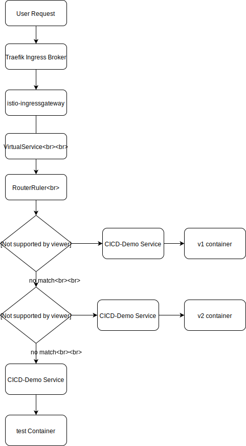

# cicd-demo

## 功能实现

- [x] 区分`stage`, `prod`, `test`环境  

- [x] 自动化`CD` & `CI`

## 流量切分图

> 如果图不能正常显示, 可以到本项目的 `resource`目录查看.

## 流量分割思路

这里我做了一下的技术选型:

- traefik(k8s ingress broker)

- istio(L7层流量分割控制)

> 不直接用 istio-gateway-ingress 是因为我没钱买 `ELB VIP`. 😢
